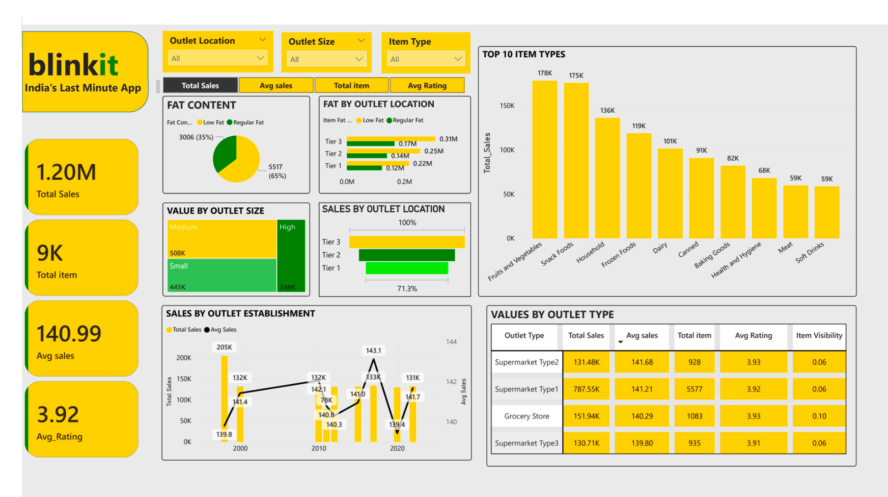

# Quick-Commerce-Sales-and-Operations-Analytics-Dashboard 

I created this project to analyze **Blinkit’s sales and operations data** using **Power BI**.  
My aim was simple: take raw sales data, clean it, transform it, and turn it into a dashboard that gives **clear, actionable insights** for decision-making.  

---

## 🔨 What I Did  

1. **Explored the Dataset**  
   - The data had columns like Item Type, Fat Content, Outlet Establishment Year, and Location.  
   - I first familiarized myself with what each column meant and how it could add value.  

2. **Cleaned & Transformed the Data**  
   - Removed columns that weren’t relevant.  
   - Standardized category names (e.g., fat content values).  
   - Dealt with missing values to make the dataset reliable.  

3. **Created Key Metrics**  
   - Using DAX, I built measures for:  
     - Total Sales  
     - Average Sales  
     - Total Items Sold  
     - Average Rating  

4. **Designed the Dashboard**  
   - Laid out the visuals in a way that’s simple but powerful.  
   - Added slicers (Outlet Type, Location, Size, Item Type) so the user can interact and drill down.  

5. **Built the Visuals**  
   - Used bar charts, donut charts, tree maps, and line charts to highlight trends.  
   - Added KPI cards for at-a-glance numbers like total sales and items sold.  

---

## 📊 What’s Inside the Dashboard  

The dashboard highlights:  
- **KPIs:** Total Sales (1.20M), Total Items (9K), Avg Sales (140.99), Avg Rating (3.92).  
- **Fat Content Analysis:** 65% Regular Fat vs 35% Low Fat.  
- **Top 10 Item Types:** Fruits & Vegetables, Snack Foods, Household items, etc.  
- **Outlet Insights:** Sales by Outlet Size, Location (Tier 1–3), and Establishment Year.  
- **Outlet Performance:** Supermarket Type 1 leads with the highest sales (~787K).  

---

## 💡 What I Learned from the Data  

Working on this project helped me strengthen both my **technical** and **analytical** skills:  

- Learned how to **clean and transform data** using Power Query in Power BI.  
- Gained hands-on experience in writing **DAX measures** for KPIs like Total Sales, Avg Sales, and Ratings.  
- Improved my ability to design **interactive dashboards** with slicers, filters, and drilldowns.  
- Practiced **data visualization techniques** (bar charts, donut charts, tree maps, line charts) to make data more meaningful.  
- Enhanced my skill in **storytelling with data** — turning raw numbers into insights about customer behavior, outlet performance, and sales trends.  
- Understood how **business context matters** — e.g., seeing how outlet size, fat content, and item type actually affect sales.    

---

## 🖼️ Dashboard Preview  

Here are the finalized pages of the dashboard:

 
---

## 📂 Files in this Repo  

- `Blinkit Powerbi DashBoard Export Template.pbit` → Power BI template file  
- `Blinkit Powerbi DashBoard Export Template pdf.pdf` → PDF export of the dashboard    

---

## 🛠️ Skills I Used  

- Data Cleaning & Transformation (Power Query)  
- DAX Calculations for KPIs  
- Data Visualization (Bar, Donut, Tree Map, Line Charts)  
- Dashboard Design & Interactivity (Slicers, Filters, Drilldowns)  
- Storytelling with Data & Business Insights  

---

## Conclusion  

This dashboard gives a **360° view of Blinkit’s sales and operations**.  
By pulling everything into one place, it helps managers track performance, compare outlets, and make **smarter, data-driven decisions**.  

---
track performance, compare outlets, and make **data-driven decisions** to improve efficiency and boost revenue.  

---
